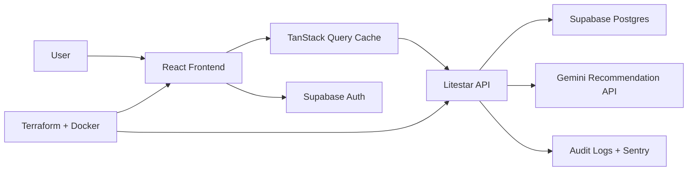
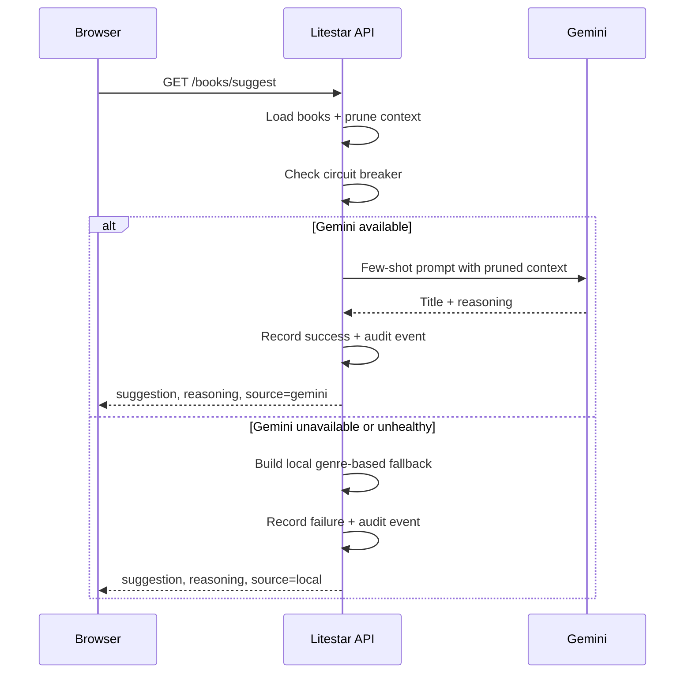

# Architecture Overview

## System Summary

Nexus Archive is a split frontend/backend application backed by Supabase:

## Frontend Responsibilities

- authenticate users with Supabase
- cache server state with TanStack Query
- render the personal media dashboard
- lazy-load the AI command palette on demand
- emit frontend telemetry to Sentry when configured

## Backend Responsibilities

- validate Supabase JWT bearer tokens
- exempt health and schema routes from auth
- enforce request schema validation with strict sanitization rules
- isolate Supabase and Gemini calls behind service functions
- emit audit records for sensitive actions
- degrade gracefully to deterministic local suggestions when Gemini fails

## AI Recommendation Flow

## Trust Boundaries

- Browser to API
- Browser to Supabase Auth
- API to Supabase
- API to Gemini
- CI/CD to Terraform-managed infrastructure

Every boundary validates configuration and input before use.

## Operational Notes

- CORS is restricted to configured frontend origins.
- Allowed hosts are derived from allowed origins.
- Backend returns secure defaults such as CSP, HSTS, `X-Frame-Options`, and `X-Content-Type-Options`.
- `GET /healthz` supports uptime checks and container orchestration probes.
- `GET /schema/swagger` exposes live API docs for stakeholder review and integration work.
