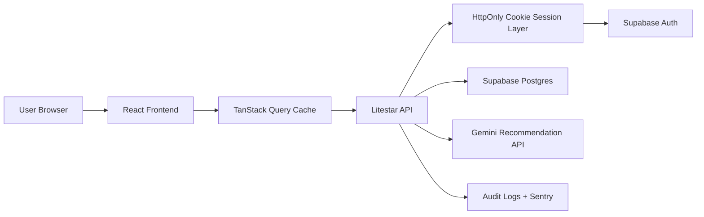
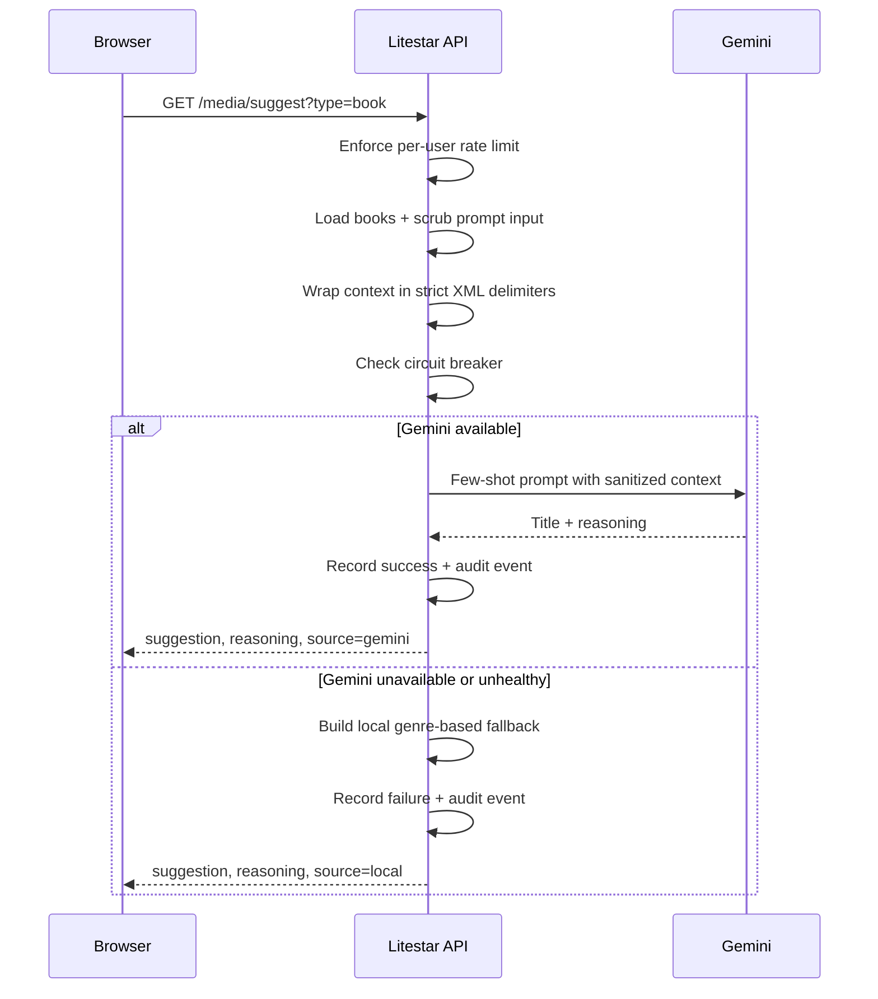

# Architecture Overview

## System Summary

Nexus Archive is a split frontend/backend media-tracking application backed by Supabase:

## Frontend Responsibilities

- authenticate through backend-issued secure cookies
- cache server state with TanStack Query
- render the personal library dashboard
- lazy-load the AI command palette on demand
- emit frontend telemetry to Sentry when configured

## Backend Responsibilities

- terminate auth at the server boundary and keep tokens out of browser storage
- validate Supabase JWT bearer tokens and cookie tokens
- enforce request schema validation with strict sanitization rules
- encrypt sensitive takeaway notes when configured
- isolate Supabase and Gemini calls behind service functions
- emit audit records for sensitive actions
- degrade gracefully to deterministic local suggestions when Gemini fails
- enforce rate limits on the expensive suggestion endpoint

## AI Recommendation Flow

## Trust Boundaries

- Browser to API
- API to Supabase Auth
- API to Supabase Postgres
- API to Gemini
- CI/CD to Terraform-managed infrastructure

Runtime boundaries enforce auth, RLS, and request validation where implemented; frontend deployment headers and provider-side auth settings must still be verified in the target environment.
