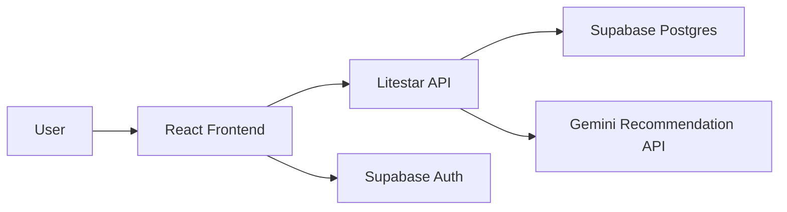

# Architecture Overview

## System Summary

Nexus Archive is a split frontend/backend application backed by Supabase:

## Frontend Responsibilities

- authenticate users with Supabase
- render the personal media dashboard
- fetch user-specific media entries from the API
- trigger AI recommendation requests

## Backend Responsibilities

- validate JWT bearer tokens
- enforce request schema validation
- isolate Supabase and recommendation calls behind service functions
- return stable API responses and controlled upstream failure handling

## Data Model

The current schema centers on a `books` table and is structured to expand toward
anime and movies. The intended generalized model is:

- `media_items`
- `media_type`
- `status`
- `rating`
- `takeaway`
- `user_id`

## Trust Boundaries

- Browser to API
- Browser to Supabase Auth
- API to Supabase
- API to Gemini

Every boundary must validate configuration and input before use.

## Operational Notes

- CORS is restricted to local frontend origins by default.
- Backend env vars are required at startup.
- Frontend env vars are required at build/runtime initialization.
