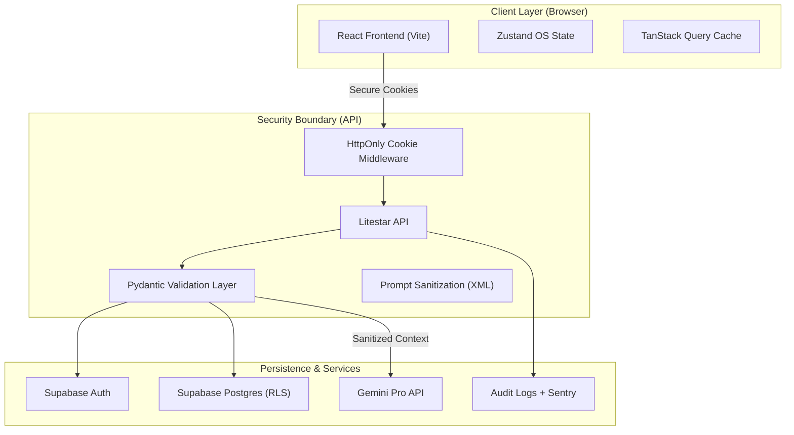

# Architecture Overview

## System Summary

Nexus OS is a split frontend/backend media-tracking and job-tracking application backed by Supabase. It prioritizes **Zero-Trust Security** and **Visual Excellence**.

## Security Invariants

### 1. Zero-Trust Auth

Nexus OS uses a backend-mediated auth flow.

- **Access Tokens**: Stored in `HttpOnly`, `SameSite=Strict` cookies. Never readable by JavaScript.
- **Refresh Flow**: Handled via `/auth/refresh` on the backend, preventing token theft from localStorage.
- **CSRF Protection**: Enforced via `SameSite` and strict CORS policies.

### 2. AI Prompt Isolation

- **XML Delimiters**: All user context is wrapped in strict XML tags (e.g., `<user_library>`) before being sent to Gemini.
- **PII Masking**: Obvious personally identifiable information is masked before reaching the LLM.
- **Scrubbing**: Markdown fences and injection probes are stripped.

## Frontend OS Shell

### Windowing & Workspace

- **Virtual DOM OS**: Implements a custom windowing system with z-stacking, snapping, and persistence.
- **Settings Engine**: Leverages the View Transitions API for theme switches and wallpaper changes (CSS-only patterns + local 4K images).

### State Management

- **Zustand**: Manages ephemeral OS state (windows, app launcher, taskbar).
- **TanStack Query**: Manages server-state and cache invalidation with Realtime Supabase sync.

## Backend Service Layer

- **LiteStar Controllers**: Handle routing and dependency injection.
- **Service Layer**: Pure business logic (e.g., `media_service.py`, `chat_service.py`) that interacts with Supabase or Gemini.
- **Data Protection**: Centralized module for encryption and prompt sanitization.

## App Directory Structure (Frontend)

Nexus OS uses a modular application registry. Each "App" is self-contained in `frontend/src/os/apps/`:

- `Library/`: Media tracking (Books, Movies, Anime) and Job Tracker.
- `Email/`: Secure email client with AI drafting.
- `Chat/`: Encrypted AI chat assistant.
- `Auth/`: Unified authentication panels and recovery.
- `Terminal/`: System console and diagnostics.

## Trust Boundaries

1.  **Browser to API**: Secured by HttpOnly cookies and CORS.
2.  **API to Supabase**: Secured by Service Role keys (server-side only) and RLS.
3.  **API to Gemini**: Secured by server-side API keys and prompt sanitization.
